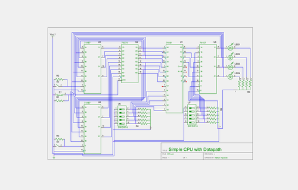
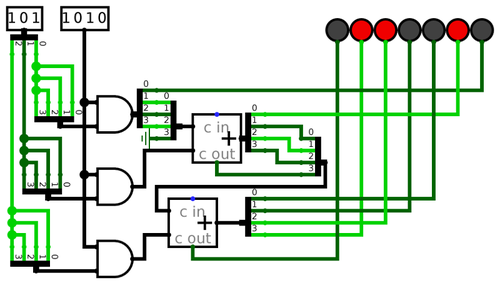
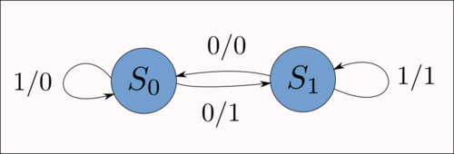

----
title: What's in a logic diagram
tags: engineering, hardware
----

> This post was on my original Tumblr blog, before I moved to a virtualized system. I originally didn't port this post, because I did not think it is very good, but now I err on the side of over-publishing.
>
> ---Nathan, 2016-12-10

It took me an unwieldy amount of time to find a program that creates publication-quality circuit diagrams. In my classes, we use [Logisim](http://ozark.hendrix.edu/~burch/logisim/). While Logisim is great software, and it does its job extremely well (lets you draw logic diagrams and directly simulate based on those diagrams), its graphics are not print-ready. The contents of a Logisim circuit diagram are rough around the edges, because they're not meant for print media.

The one trick that can aid a Logisim printout, and you see this in action above, is exporting at a very high resolution (say 2980 pixels wide for the above diagram) png, and then downscaling that significantly for print. This takes away the aliasing at the edges, and for demonstrating simulations themselves like in the above diagram, the results are beautiful.

As time passed and I became versed in digital design, I started wanting more from my circuit diagrams. Or, to put it better, I wanted something *different*. In most cases, I wasn't creating circuit diagrams anymore in order to verify that my idea works. I could write Verilog code for that, and have it finished quickly and with better debugging ability than Logisim offers. Circuit diagrams, then, are drawn after the code simulation in order to provide a visual aid to the physical prototype. Sometimes, they also offer a quicker and less painful means of understanding the design and function of a circuit. So the impetus for circuit diagrams has shifted—from mere simulation with the benefit of visuals—to a purely visual language meant to painlessly convey meaning.

Inkscape, which I used for my state diagrams, wasn't an option. The best I could find in terms of logic symbols was [this post on the Gentoo forums](http://forums.gentoo.org/viewtopic-t-653135-start-0.html) which wasn't especially helpful. User Naib apparently employs Inkscape for vector logic diagrams, but

> I keep re-drawing my parts when I need them simply because while Inkscape is great (I use it for circuit drawing as well) ...

This post demonstrates the real problem with using vector drawing software for logic diagrams: everything becomes manual. There's no complete and useful library of Inkscape logic vectors to choose from. There's no automatic aligning of wires, symbols, and inputs. You handle all of that manually. And while this may be acceptable for long, complex projects where spending days perfecting each logic diagram is worth doing, it's not a solution for real work.

Then there's options like [logic.ly](http://logic.ly). I tried the online demo, and found my mouse flying on its own across the screen, well past where I was trying to move it. In addition, I'm not a fan of the "curved lines for wires" approach. There is lots of *bad* circuit diagram software, and it doesn't help that logic.ly, proprietary software, isn't a huge improvement upon the free-as-in-freedom Logisim.

[Giraffe](http://freecode.com/projects/giraffe) looks interesting, but I haven't had a chance to try it yet.

I realized that I needed something more advanced. I wasn't looking for a logic diagram editor, because in that arena Logisim takes the cake and there aren't any good alternatives. What I wanted was schematics.

Eventually I found gschem, part of the very UNIX-influenced [gEDA](http://en.wikipedia.org/wiki/GEDA) suite. gEDA is not a complete software package, but rather a collection of loosely integrated tools that, at least in theory, all work together. I've found varying degrees of success in using all of the gEDA suite's functionality. For example, I can create schematics in gschem, but generating netlists from these schematics, something that should be feasible at least in theory, can be complicated. Simulating a netlist works great, but that's provided you have one in the first place. Such are the perils of extremely distributed software design. It works well for GNU/Linux, because people are prone to picking and choosing between a variety of individual options and merging them into one working system. But gEDA doesn't have this benefit; most of its software is built to interact with the rest of the suite, but the suite as a whole is missing that core integration that would make it so useful.

Regardless, gschem produces absolutely lovely circuit schematics, and I've used it for all of my documents for nearly a month.

It's worth noting that the above isn't exactly a logic diagram. It's a circuit schematic. While gschem handles logic diagrams just as well, they're no longer my primary choice for the job. I can just as easily draw a full circuit schematic, include all my resistors and connections to the right pinouts, as I can crank out AND gates and generic "input" blocks. It's just a matter of which is more useful for the job, and if I'm actually *building* the circuit in question, it's much more handy to have a full schematic.

Once I find the need for a more fully-functioned (or at least better integrated) CAD suite, I'll probably research properly using gEDA or start testing my other options, like [qCAD](http://www.qcad.org/en/). For starters, Wikipedia has a fantastic page [Comparison of EDA Software](http://en.wikipedia.org/wiki/Comparison_of_EDA_software) that I intend to peruse in the coming weeks.
