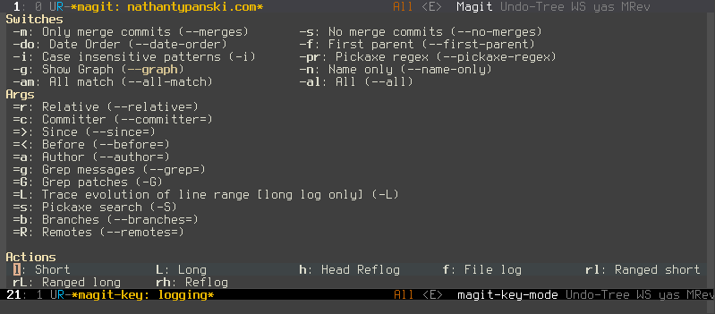

----
title: Switching to Emacs: Becoming Evil
tags: Emacs, Evil
----

Last December I started switching from Vim to Emacs+[Evil](http://www.emacswiki.org/emacs/Evil), which is a Vim emulation layer for Emacs. I think I've used this setup enough to comment intelligently on it, so I'll talk about the experience and some of the cool tricks I've picked up along the way.

## Evil is not Vim ...

... but it's pretty darn close. It's better than [Vrapper](http://vrapper.sourceforge.net/home/) for Eclipse, [VsVim](http://visualstudiogallery.msdn.microsoft.com/59ca71b3-a4a3-46ca-8fe1-0e90e3f79329) for Visual Studio, and any other Vim-like plugin that you can think of.

Try this out in your "Vim plugin": hit `qq` to start recording a macro, `F(` to search backwards for an opening paren, `ldt)` to delete until the closing paren, `mm` to mark, `bbyw` to copy the word from before the paren, `` `m `` to jump back to the mark, `hp` to paste it inside the parens, `q` again, and then `@q` to use the macro. Then hammer `@@` a few times, running the macro elsewhere in the file.

Now do a visual block selection, hit `I` and type some text, and then hit `<ESC>` twice to apply it. Was that text added across all of the lines? Cool - repeat that with `A` to append instead of insert, on lines with different text widths.

Now visual select a huge line. Hit `<ESC>gq` to wrap it to 80 columns, breaking at word boundaries.

Did your editor pass? Great! It has usable Vim emulation. Otherwise, sorry, your plugin just broke my workflow. I always cringe slightly whenever my reflexes start to try this and it breaks. Vim is that ingrained in me - it's my default brain mode for editing text, and the only bindings that give me maximum editing ability with minimum keystrokes.

Evil is the only plugin I've found that comes close to getting this right.

## If Vim is so great, why bother switching?

Vim has awesome keybindings. A ton of people agree with this - they do wonders for keeping RSI at bay and letting you automate tedious text editing. It's like an interactive Perl golfing machine, except you don't have to think about what you're doing because the bindings get immortalized in your neural circuitry.

But Vim has warts. Big, ugly warts.

- Vimscript. It is the [PHP of plugin languages](http://www.reddit.com/r/vim/comments/1bf672/why_does_viml_suck/). Keymappings can [recurse endlessly](http://learnvimscriptthehardway.stevelosh.com/chapters/05.html). Autocommands [do insane things](http://learnvimscriptthehardway.stevelosh.com/chapters/14.html). Mapping keys the wrong way will do different things [depending on users' keymaps](http://learnvimscriptthehardway.stevelosh.com/chapters/29.html). Nothing is obvious. There are edge cases to avoid when handling edge cases, and they *sometimes* cause [nasal demons](http://en.wikipedia.org/wiki/Undefined_behavior).
- Asynchronous operations are impossible. Well, not really, [LaTeX box](https://github.com/LaTeX-Box-Team/LaTeX-Box/blob/master/doc/latex-box.txt) fakes it with VimServer for example - but that's not a pretty solution.
- Vim is slow. This might sound crazy when compared with Emacs' startup times, but it's for real. Specifically, it's slow when editing files that need ridiculous amounts of word wrap or syntax highlighting. For my work at NASA I sometimes dealt with data files where one line would wrap across the whole screen two times over. Oh, and they're 150 MiB. Vim *crawls* when rendering this stuff, and it's unusable. When editing my Python code there, I'd sometimes have files that needed to represent massive nested lists of text (metadata for the data files we worked with). Vim also crawls for those every time a bracket or comma would change - the regexps for syntax highlighting simply weren't fast enough.

Emacs gets these things right.

- It's scriptable in a Lisp dialect, which means the knowledge gained from writing it is actually useful outside your editor (the core concepts of Lisp programming are consistent across dialects, even if the details and libraries differ). This also means that when I bind a key, it's bound to a real function call in a real programming language - and that's much closer to what I'm used to doing as a programmer than Vim's approximations.
- Asynchronously running a command is easy. I can [`ag`](https://github.com/ggreer/the_silver_searcher) the Linux kernel while writing this blog post, and my editor won't skip a beat.
- None of the rendering slowness that I talked about for Vim. It's speedy for text editing and viewing, regardless of how ugly the input is.

Of course, Emacs has its own problems, but the combination of the above and useful Vim emulation were what sold me on giving it a shot.

## New habits

The first habit I had to break was to stop hammering `<ESC>:wq` when I was done editing a file. Or `<ESC>\w\q`, for that matter, since I find typing `:` cumbersome. When you use Emacs, the tendency is to just keep it running - if you load a bunch of plugins, it starts slowly, and you're stuck waiting for `6` seconds to reopen it.

There are occasional problems in the emulation that Evil offers. They're not massive, and I can't remember any off the top of my head, but they exist. Thankfully, Evil has an [active devteam](https://gitorious.org/evil) that works hard to fix them.

The other big issue happens when you start digging into Emacs features. Usually they come with Emacs bindings, and you'll be confused about how to use them. You have a couple options for overcoming this:

- Learn the Emacs bindings. I do this for some plugins, like [Magit](https://github.com/magit/magit), where they're not so much "Emacs bindings" as they are just "keybindings". Magit's bindings are actually more Vim-like than even [Fugitive](https://github.com/tpope/vim-fugitive)'s:
    - Every binding in the Magit windows is a key chord. For example, when I look at my Git status window, and press `l`, that indicates that I want to do a "log action" and it's followed by another single key indicating the exact thing I'd like performed. There's even a handy popup buffer that lists my available choices:

    

    All of the common Git operations are bound to single key sequences like this: there's no `C-g-M-X-^<CTRL><Menu>` in sight.

- Rebind keys yourself. This is good for features that you use often, though it means writing your own keybindings. It's not a huge task, and it's aided by the fact that your available operations are functions and you can search for them (`M-x apropos-command`), but this takes time.
- Let Evil overlay Vim bindings into the plugin. This has varying levels of success. For one, it won't (by default) override keys that are already bound in the Emacs plugin ("Major mode" as they're called - Evil uses the term "state" to refer to Vim modes). This means you can end up with `h`, `j`, and `l` bound in a major mode, but `k` does something different - like kill the commit in a Git rebase - and this can be unnerving.

All in all, I've found the keybinding issues in major modes to be workable. Per [Emacs as my <Leader>](http://bling.github.io/blog/2013/10/27/emacs-as-my-leader-vim-survival-guide/), a fantastic post from the author of [`vim-airline`](https://github.com/bling/vim-airline), I've bound `\` to "take me to Emacs state" and learned enough Emacs idioms to find my way around in new modes.

## A whole new world

I think there's a fundamental dichotomy between Vim's philosophy as an editor and that of Emacs: Vim is a text editor. Emacs is far more, sometimes jokingly called an ["operating system"](http://developers.slashdot.org/comments.pl?sid=3465893&cid=42919741): it's more like a full-blown IDE for *everything*.

There's a fairly recent trend in Vim plugin development, where people try to maneuver Vim into being a complete development environment. It's [not really made for that](http://www.gwern.net/Choosing%20Software#fn2), which shows in everything from the poor design of Vimscript to the lack of asynchronous capabilities: Vim is a world-class text editor. Only by coincidence have people managed to make it into something more.

So Emacs has some features that Vim's codebase would (and should!) scoff at including in the base editor. For example, an [insanely powerful file browser](https://www.gnu.org/software/emacs/manual/html_node/emacs/Dired.html), capable of traversing SSH tunnels and editing remote files. Or a built-in [wiki/personal organization system](http://orgmode.org/), running entirely in plain text. An [ascii flowchart drawer](http://www.emacswiki.org/emacs/ArtistMode). A [table editor](https://www.gnu.org/software/emacs/manual/html_node/org/Built_002din-table-editor.html). All of this in the Emacs core - no plugins attached.

The end result is something that feels much closer to a complete programming *environment* rather than just a text editor. Since this is something many people try to mod Vim into, I think if you're part of that group then you should take a long, hard look at the Dark Side before trying too hard at making Vim do everything.

Or don't. Vim has a large and incredibly dedicated group of programmers writing plugins for it: you'll find plenty of awesome plugins on either side of the fence.
